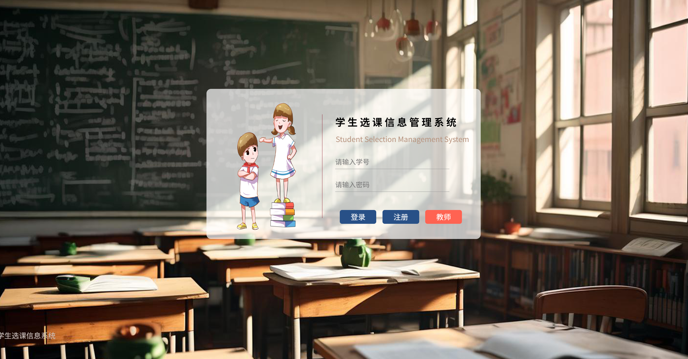
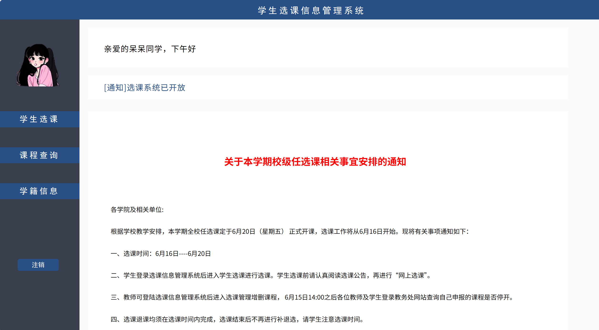
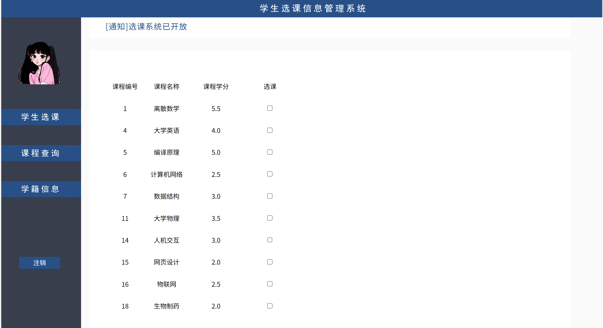
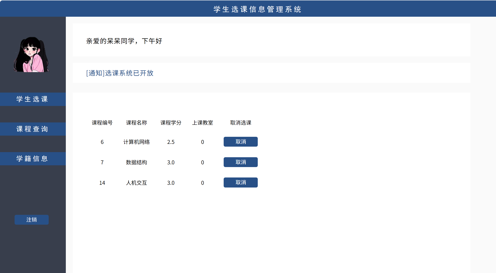
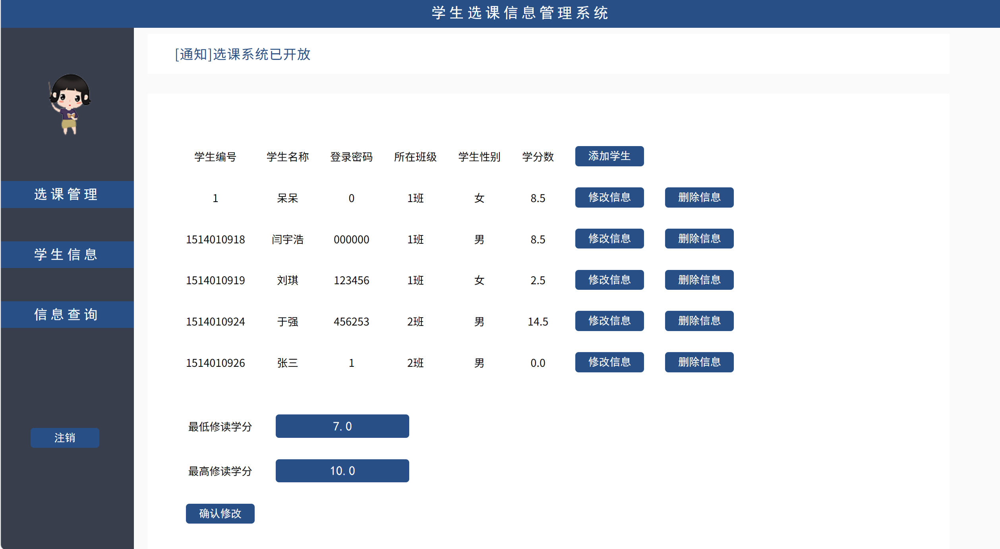
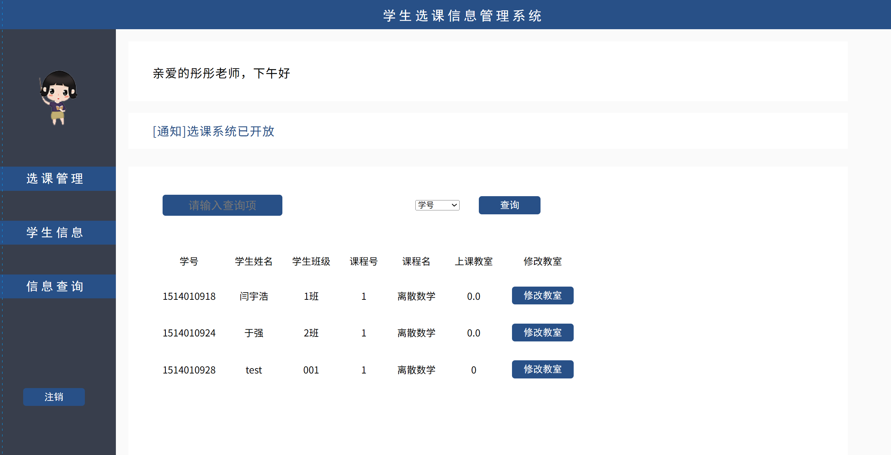
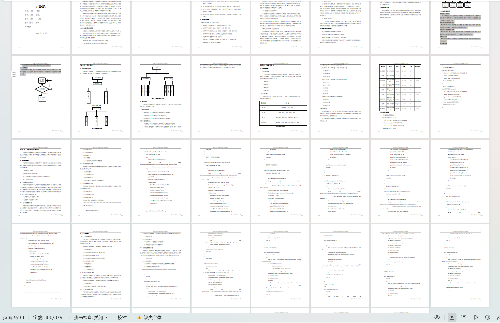

# jspServlet008
jspServlet008学生选课管理系统+BG+PPT
 
## 查看主页获取源码

### 一、关键词
学生选课信息管理系统，学生选课系统

### 二、作品包含
源码+数据库+设计报告文档+PPT+全套环境和工具资源+本地部署教程

### 三、项目技术
前端技术：Html、Css、Js、Jquery
后端技术：Java、JSP、Servlet、JDBC

### 四、运行环境（以下版本亲测，其他版本兼容性请自行测试）
开发工具：IDEA/eclipse

数据库：MySQL5.7或8.0

服务器：Tomcat8.5或Tomcat9.0

数据库管理工具：Navicat10以上版本

环境配置软件： JDK1.8

浏览器：谷歌浏览器

### 五、项目介绍
项目编号：jspServlet008

学生选课信息管理系统是一个教育单位不可缺少的部分,它的内容对于学校的决策者和管理者来说都至关重要,所以学生信息管理系统应该能够为用户提供充足的信息和快捷的查询手段.但一直以来人们使用传统人工的方式管理文件档案,这种管理方式存在着许多缺点,如:效率低、保密性差,另外时间一长,将产生大量的文件和数据,这对于查找、更新和维护都带来了不少的困难.

用户验证登录模块
    用户根据自己身份，选择相应的登录选项（教师或学生）登录，与数据库中数据相验证，若用户存在，则跳转到相应页面；若用户不存在，则提示密码或用户名错误，跳回登录页面。
教师对课程信息的操作模块
  教师可以添加课程、删除课程、修改课程，查询课程。修改、删除、添加模块应有修改成功的提示，查询页面应有分页显示功能。
教师对学生信息的操作模块
  教师可以添加、修改，删除、查询学生信息。对学生信息的修改、删除、添加操作应该有修改成功的提示，对学生的查询应该可以分页显示。
模糊查询功能
  教师用户可以根据某一个数据项查询学生或课程信息，或是查询含有某一字符的相关元组。
学分控制模块
本模块可统计选课学分不足或是学分超出上限的学生。
学生选课模块
  学生可查看所有课程，可选择选课人数未满课程。选课前要有确认选项。选课后不能更改。成功选课后，选课对该学生关闭。该学生只能看到已选课程以及课程信息。

### 六、运行截图

